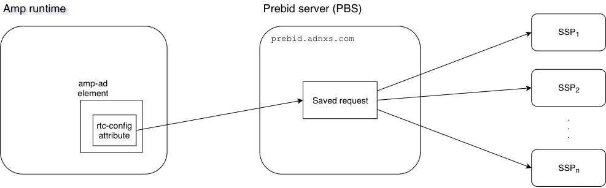

# Amp integration

## Overview

  
<a href="https://www.draw.io/#Uhttps%3A%2F%2Fgithub.com%2Fguardian%2Fprebid-server%2Famp%2FAmp.png" target="_blank">Edit</a>

## Resources
* Amp runtime is configured in the [frontend](https://github.com/guardian/frontend) repo.
* The PBS is [here](https://prebid.adnxs.com/).

## Configuration
These are the current stored requests:
* [UK and International editions](4.json)
* [US edition](7.json)
* [AU edition](6.json)

## Testing a stored request
0. Set up `dev.theguardian.com` as an alias host for `localhost`.
0. Run frontend locally and ensure the `prebid-amp` switch is on.
0. Go to an Amp locally.  
   Eg. `http://dev.theguardian.com:9000/world/2018/nov/06/new-discovery-throws-light-on-mystery-of-pyramids-construction?amp`
0. In the network console, look for a request going to `prebid.adnxs.com`.
0. The response should have a `targeting` section, and a call to each bidder in a `debug.httpcalls` section.  If the call failed there will also be an `errors` section.
0. In the current folder, update the file with the same name as the `tag_id` parameter of the Prebid request.  
   Eg. if the Prebid request shown in the network console starts `https://prebid.adnxs.com/pbs/v1/openrtb2/amp?tag_id=3&...`,  
   update the file called `3.json`.
0. Log in to `https://prebid.adnxs.com/`.
0. Go to `https://prebid.adnxs.com/amp/` and edit the request with the same placement ID as the file just updated.
0. Overwrite the request with the request updated locally and save it.

## Useful docs
* [amp.md](../docs/endpoints/openrtb2/amp.md)
* [auction.md](../docs/endpoints/openrtb2/auction.md)
* [Show Prebid ads on Amp](http://prebid.org/dev-docs/show-prebid-ads-on-amp-pages.html)
* [OpenRTB 2.5 spec](https://www.iab.com/wp-content/uploads/2016/03/OpenRTB-API-Specification-Version-2-5-FINAL.pdf) - this is the format of saved requests in PBS
